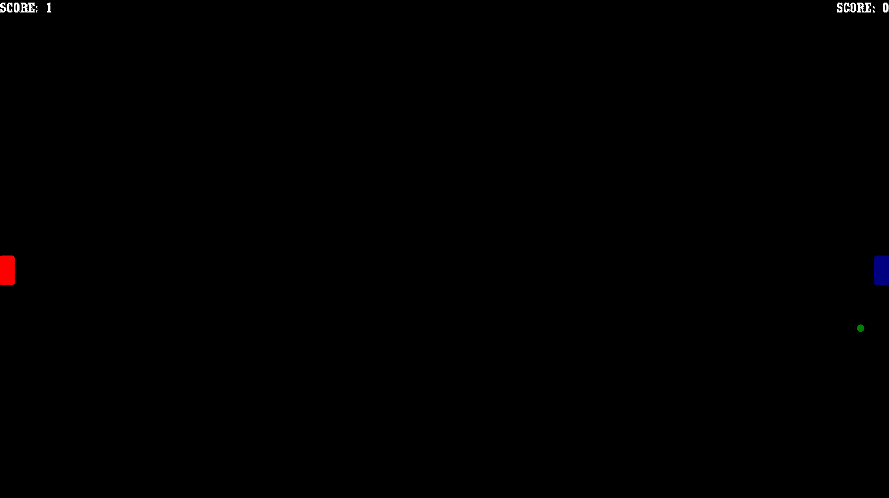

# Pong Game Replica

This repository contains a C++ implementation of a Pong game replica using the Simple and Fast Multimedia Library (SFML). The game adheres to a specific assignment with various features and requirements.

<table>
  <tr>
    <td></td>
    <td></td>
    <td></td>
  </tr>
</table>


## Assignment Overview

### Features and Requirements

1. **Main Menu Screen**: The game starts with a Main Menu Screen featuring:
   - A background image stretched according to the size of the window.
   - Play Button
   - Quit Button

2. **Player Controls**:
   - Player 1: Arrow keys (⬆️ for up, ⬇️ for down)
   - Player 2: 'W' and 'S' keys

3. **Game Rules**:
   - The game is a best-of-5 matches.
   - The first player to score 5 points wins.

4. **Game Over Screen**: When the game ends, a basic game over screen displays the winner and loser.

5. **Code Quality**:
   - Code adheres to Object-Oriented Programming (OOP) and SOLID principles.
   - Code is well-documented with clear naming conventions.
   - Emphasis on code readability.

6. **Core Elements**:
   - Player movements are framerate-independent and smooth.
   - Ball movement is framerate-independent and smooth.
   - Score logic and game win/lose conditions are implemented.

7. **Audio**:
   - Background music plays when the game starts.
   - Sound effects for ball collisions and button clicks are implemented.

8. **Player Names**:
   - Player names are not required; players are referred to as P1 and P2.

## Running the Game

To run the game, follow these steps:

1. Clone this repository to your local machine:

   ```bash
   git clone https://github.com/akankshaprasad8/ping-pong-game.git
2. Install SFML if you haven't already. You can download it from [SFML's official](https://www.sfml-dev.org/index.php) website or use your package manager:

3. Compile the game using a C++ compiler, ensuring you link against the SFML libraries:
   ```bash
   g++ -o pong main.cpp -lsfml-graphics -lsfml-window -lsfml-system

4. Run the compiled executable:

   ```bash
   ./pong

## Game Controls

### Player 1 (P1):

Up: Arrow Up (⬆️)
Down: Arrow Down (⬇️)

### Player 2 (P2):

Up: 'W' key
Down: 'S' key

### Gameplay Instructions

Use the controls to move your paddle and bounce the ball.
Score points by getting the ball past your opponent's paddle.
The first player to score 5 points wins the match.

## Code Structure

The codebase for this game is thoughtfully organized into various files and classes to ensure clarity and adhere to Object-Oriented Programming (OOP) principles. Here's an overview of the key components:

#### `main.cpp`:
This file contains the game's main function, window setup, and the core game loop.

#### `GameState.h`:
This file provides a framework for managing the game state, ensuring smooth transitions between different game screens.

#### `MainMenu.h` and `MainMenu.cpp`:
These files define the main menu screen and its functionality, allowing players to start the game or quit.

#### `MainGame.h` and `MainGame.cpp`:
Here, you'll find the code for the main gameplay screen, where the core action of the game unfolds.

#### `Result.h` and `Result.cpp`:
These files manage the display of results at the end of a game, showcasing the winner and loser.

#### `Entity.h`:
This fundamental class defines the properties of game entities, including sprites, textures, and text elements.

#### `PaddlePlayer.h` and `PaddlePlayer.cpp`:
The `PaddlePlayer` class, extending from `Entity.h`, handles the behavior and rendering of the paddle entities.

#### `Ball.h`and `Ball.cpp`:
The `Ball` class, which also extends from `Entity.h`, governs the ball's attributes and rendering.

#### `Score.h` and `Score.cpp`:
These files are dedicated to tracking and updating the game's score.

#### `Graphics` Folder:
Contains graphical assets such as images for the ball and paddles, organized for visual elements in the game.

#### `Sounds` Folder:
Houses sound files, including bounce sound effects and background music, enhancing the gaming experience.


### Acknowledgments
Thanks to the creators of SFML for providing a fantastic library for game development.

### Author
Akanksha Prasad

Feel free to reach out with any questions or suggestions!
